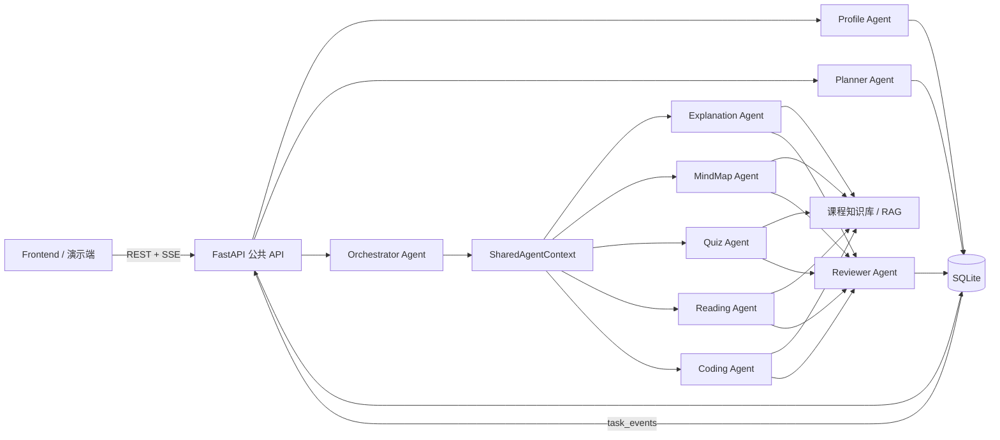
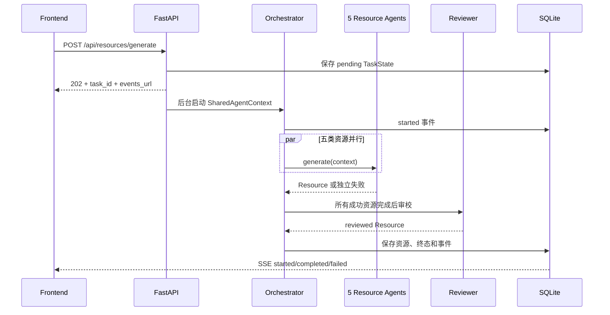
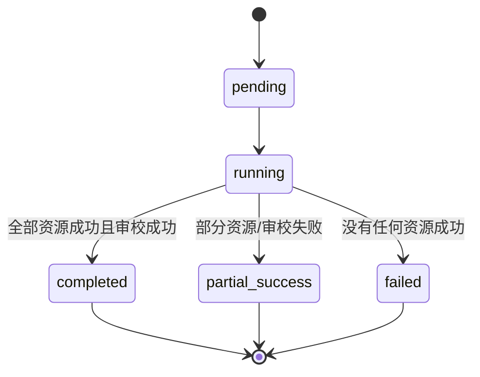

# EduAgent 系统架构（第一阶段基线）

版本：0.1.0  
状态：Day 1 公共架构已固定  
默认课程：《机器学习基础》

## 1. 架构目标与边界

系统在一台普通开发电脑上以单个 FastAPI 进程运行，通过 SQLite 保存可恢复状态。架构首先保证 P0 闭环：自然语言画像、顺序学习路径、五类资源协作、知识库来源、审校、任务进度和可演示运行；暂不引入消息队列、微服务、登录、语音或视频等非必要复杂度。

公共契约保持 `api-contract-v0.1` 不变。Profile Agent 与 Planner Agent 已由统一 `LLMClient` 驱动结构化输出，并在进入公共模型前再次执行证据、顺序、时间和 Pydantic 校验。配置缺失或调用失败时显式使用既有开发适配器，不冒充大模型结果：Profile 使用冻结枚举 `development_heuristic`，Planner 使用冻结枚举 `development_rule_based`；真实结构化结果均使用 `llm_structured`。

公共模型命名以代码为准：`Resource` 是学习资源实体，`TaskState` 是资源生成任务状态实体。所有成员必须复用这两个模型，不得另建 `LearningResource`、`GenerationTask` 等同义契约。

## 2. 总体架构

## 3. 模块职责

| 模块 | 主要职责 | 代码位置 |
|---|---|---|
| API | 请求校验、错误响应、REST、SSE、依赖装配 | `backend/app/api` |
| Schemas | 唯一公共数据契约，禁止各模块自行复制模型 | `backend/app/schemas` |
| Profile | 从对话/评价证据抽取并版本化学生画像 | `backend/app/profile` |
| Planner | 根据画像、薄弱点、时间和评价生成有序路径 | `backend/app/planner` |
| LLM | 供应商无关协议、OpenAI兼容传输、异常分类、超时重试和测试Fake | `backend/app/llm` |
| Orchestrator | 共享状态、并发资源生成、失败隔离、审校、事件 | `backend/app/orchestrator` |
| Database | SQLite 初始化与画像、路径、资源、任务、事件仓储 | `backend/app/database` |
| RAG/Resources/Guardrails/Evaluation | Agent 2 实现的知识检索、五类资源、审校与评价 | 对应 `backend/app/*` 目录 |
| Frontend | Agent 3 实现的对话、路径、资源和任务进度界面 | `frontend` |

## 4. 智能体定义

| 智能体 | 输入 | 输出 | 状态影响 |
|---|---|---|---|
| Orchestrator Agent | 画像快照、路径、资源请求 | TaskState、TaskEvent、资源 ID | 维护任务状态，组织并行与审校 |
| Profile Agent | 对话历史、旧画像、可选评价摘要 | StudentProfile 新版本、缺失字段、追问 | 新增画像版本，不覆盖历史版本 |
| Planner Agent | StudentProfile、旧路径、可选评价摘要 | LearningPath | 生成新路径，旧路径可标记 superseded |
| Explanation Agent | SharedAgentContext、RAG 片段 | explanation Resource | 写入一项来源可追溯资源 |
| MindMap Agent | SharedAgentContext、RAG 片段 | mind_map Resource | 内容格式为 Mermaid |
| Quiz Agent | SharedAgentContext、RAG 片段 | quiz Resource | 内容格式为 JSON/Markdown，支持分层题目 |
| Reading Agent | SharedAgentContext、RAG 片段 | reading Resource | 提供来源与拓展关系 |
| Coding Agent | SharedAgentContext、RAG 片段 | coding Resource | 提供可运行代码与说明 |
| Reviewer Agent | 全部已生成资源、共享上下文 | 更新 review_status 的 Resource | 在全部资源 Agent 结束后统一审校 |
| Evaluation Agent | 答案、路径步骤、题目依据 | EvaluationResult | 触发画像新版本与路径调整 |

资源 Agent 必须实现 `ResourceAgent` 协议：公开 `agent_name`、`resource_type`，并提供异步 `generate(context)`。Reviewer Agent 必须实现 `ReviewerAgent.review(resource, context)`。Agent 2 在 `app.resources.registry.register_agents(registry)` 中统一注册；公共启动代码将自动加载该入口。

## 5. 状态传递与主流程

### 5.1 画像与路径

1. 前端提交自然语言对话历史。
2. Profile Agent 只提取结构化事实，不把原文直接作为画像值；每个字段保存证据与置信度。
3. 字段不足时返回 `missing_dimensions` 和一个自然语言追问。
4. 每次有效对话或评价更新都创建画像新版本。
5. Planner Agent 使用最新画像版本、薄弱点、目标、认知风格、资源偏好和时间预算生成顺序路径。
6. 评价发生变化时，传入评价摘要和旧路径 ID，生成调整后的新路径。

Profile 与 Planner 的模型调用只依赖 `LLMClient.generate_structured`，业务模块不调用厂商 SDK。客户端把私有响应模型的 JSON Schema 提供给模型，对响应进行 JSON 解析和 Pydantic 校验；Agent 再把验证后的私有草稿映射到冻结公共模型。异常分为配置缺失、网络、超时、服务端、安全拒绝、返回格式和 Pydantic 校验失败，重试次数有限，日志只保留安全摘要，不记录密钥或完整请求。

Profile 会核验 `conversation` 证据的 `quote` 是否逐字存在于对应 `message_id`，区分 `inference` 与 `system_default`，合并旧画像后创建 `version + 1`。Planner 会核验步骤连续、主题不重复、前置知识只引用已完成步骤、单步时长符合每日预算且总时长等于各步骤之和；知识库尚未接入时禁止声称完成了检索。

### 5.2 资源生成与审校

`SharedAgentContext` 是资源阶段唯一共享状态，包含 `task_id`、请求、不可变画像快照和不可变路径快照。Agent 不得通过全局变量传递结果。

## 6. 任务状态机与失败策略

- Agent 运行状态为 `pending | started | completed | failed | skipped`。
- 每个 started、completed、failed、review 和任务终态均写入 `task_events`。
- `asyncio.gather` 并发调用五类资源 Agent，每个异常转换为该资源的失败结果，不传播为全任务崩溃。
- 所有生成调用结束后才进入 Reviewer；无成功资源时 Reviewer 标记 skipped。
- SSE 支持 `Last-Event-ID`/`after` 断线续传，事件持久化后进程内重连不会丢失。
- 本架构为单进程演示设计；生产多进程需将后台执行迁移到外部队列，但不属于本赛程 P0。

## 7. 数据持久化

SQLite 默认配置为 `DATABASE_URL=sqlite:///./data/eduagent.db`。相对路径由配置模块固定相对仓库根目录解析，因此从仓库根目录或 `backend` 目录启动都会使用同一数据库；也可通过明确的绝对 SQLite URL 覆盖。当前表：

| 表 | 主键 | 用途 |
|---|---|---|
| `profiles` | `(student_id, version)` | 保存完整画像版本历史 |
| `learning_paths` | `path_id` | 保存路径及所依赖画像版本 |
| `resources` | `resource_id` | 保存通过结构校验的资源与审校状态 |
| `tasks` | `task_id` | 保存任务当前状态 |
| `task_events` | `(task_id, sequence)` | 保存严格递增的 SSE 事件 |

SQLite 启用 WAL、外键和事务；事件序号使用 `BEGIN IMMEDIATE` 分配，避免并发 Agent 产生重复序号。

## 8. 安全、结构校验与幻觉防范

- 所有输入输出统一通过 Pydantic 校验，模型默认拒绝未知字段。
- API 密钥只从环境变量读取，仓库仅提供空值 `.env.example`。
- Resource 的 `source_references` 至少一项；无可靠知识库依据时 Agent 必须失败或明确表示无法确认，不得伪造来源。
- Reviewer 负责事实一致性、来源覆盖、难度适配、个性化相关性与安全检查。
- 第一阶段未注册资源 Agent 时任务明确失败；评价接口明确返回 501，不返回伪造结果。
- `development_heuristic` 和 `development_rule_based` 仅作为公开可见的可靠降级模式；真实 LLM 成功时必须标记 `llm_structured`。最终演示应配置真实模型服务并保留降级预案。

## 9. 五天集成节奏

- Day 1：固定本文和 API 契约；健康检查、画像桩、路径桩、SQLite、任务与 SSE 骨架可运行。
- Day 2：统一 LLM 客户端、真实 Profile/Planner、真实案例；替换第一阶段开发适配器。
- Day 3：注册五类资源 Agent 与 Reviewer，接入 RAG；评价更新画像与路径；端到端联调。
- Day 4：冻结非必要功能，只修复、补测试、文档、演示与许可证。
- Day 5：全量回归、离线预案、视频/PPT/提交物审查。
