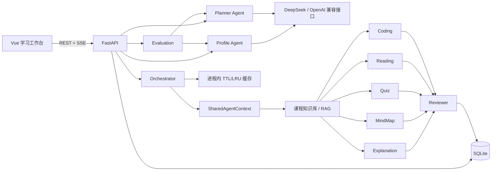
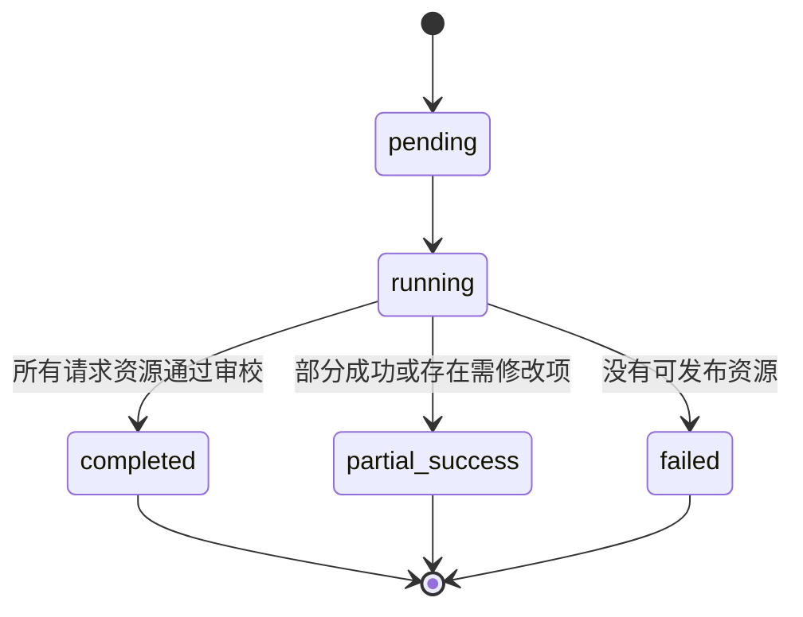

# EduAgent 系统架构

版本：`0.1.0`

公共契约：`api-contract-v0.1`

默认课程：《机器学习基础》

## 1. 架构目标与边界

EduAgent 在一台普通 Windows 开发电脑上以单个 FastAPI 进程和一个 Vue 前端运行。系统优先保证可解释、可恢复、可演示的完整学习闭环：

`自然语言对话 → 学生画像 → 学习路径 → RAG → 五类资源 → Reviewer → SSE → Quiz → Evaluation → 画像更新 → 路径重规划`

当前不引入消息队列、微服务、登录、管理员后台、语音或视频。公共 API、Schema、字段、枚举和资源类型保持冻结。

## 2. 总体架构

DeepSeek 是运行时学习内容模型，通过供应商无关的 `LLMClient` 使用 OpenAI 兼容协议。业务 Agent 不直接依赖厂商 SDK。Codex 是本项目开发期间使用的 AI 编码协作工具，不参与生产运行时决策；使用边界见 `docs/ai-coding-tool-statement.md`。

## 3. 模块职责

| 模块 | 职责 | 位置 |
|---|---|---|
| API | 请求校验、错误响应、REST、SSE、依赖装配 | `backend/app/api` |
| Schemas | 唯一公共数据契约 | `backend/app/schemas` |
| Profile | 对话和评价证据抽取、画像版本化 | `backend/app/profile` |
| Planner | 初始路径和评价后重规划 | `backend/app/planner` |
| LLM | OpenAI 兼容传输、超时、有限重试、结构化响应 | `backend/app/llm` |
| Orchestrator | 并行生成、缓存、失败隔离、审校和任务终态 | `backend/app/orchestrator` |
| RAG | 课程文档加载、检索、来源引用和知识库版本 | `backend/app/rag` |
| Resources | 五类资源 Agent、私有 Draft 和 Reviewer | `backend/app/resources` |
| Evaluation | 持久化 Quiz 评分和学习反馈 | `backend/app/evaluation` |
| Database | 画像、路径、任务、事件和资源持久化 | `backend/app/database` |
| Frontend | 对话、路径、资源、SSE 和评价界面 | `frontend/src` |

## 4. 画像与路径

前端向 Profile API 提交完整对话历史，最新用户消息在请求前已经加入 `messages`。Profile Agent 产生带字段级证据和置信度的私有 Draft，经业务校验后映射到公共 `StudentProfile`。画像更新创建新版本，不覆盖历史记录。

证据分为：

- `conversation`：学生明确说出的内容。
- `inference`：由对话归一化得到的推断。
- `evaluation`：Quiz 评价产生的证据。
- `system_default`：安全默认值。

Planner 使用指定画像版本、目标、薄弱点、偏好和时间预算生成连续且不重复的步骤。每一步都包含目标、原因、推荐资源、完成标准、预计时间和前置知识。评价后会传入旧路径和压缩后的评价摘要，生成带 `adjustment_reason` 的新路径。

模型配置缺失、网络、超时、安全拒绝或结构化验证失败时：

- Profile 显式使用 `development_heuristic`。
- Planner 显式使用 `development_rule_based`。
- 真实结构化成功使用 `llm_structured`。

界面和安全日志会显示模式，不记录密钥或完整模型响应。

## 5. RAG 与五资源并行生成

知识库由以下内容构成：

- `data/machine_learning/syllabus.md`
- `data/machine_learning/sources.json`
- `data/machine_learning/01-*.md` 至 `08-*.md`

加载器按章节切分文档，Retriever 依据主题和难度返回最多五个匹配片段。`SourceReference` 的 `source_id`、标题、定位和 chunk ID 均来自这些真实文件。没有可核验来源时，资源 Agent 失败，不创建演示引用。

Orchestrator 使用 `asyncio.gather` 并行运行请求中的资源 Agent。每个 Agent 获得同一个不可变 `SharedAgentContext`，其中包含任务、请求、画像快照和路径快照。单个 Agent 的异常被转换为该资源的失败结果，不会取消其他 Agent。

## 6. 私有 Draft、格式修复与 fallback

公共 `Resource` 未改变。格式稳定性通过更小的私有 Draft 处理：

- Quiz：恰好 3 题；基础题是 4 选 1，进阶和挑战题是简答；答案和解析必填。
- MindMap：私有 Draft 只携带 Mermaid 内容，最终公共内容只保留以 `mindmap` 开头的正文。
- Reading：概览、恰好 3 个核心要点、实践联系和后续学习。

仅对明确、安全且不改变事实的问题做归一化：

- 统一 Quiz 的 A–D 选项与答案标签。
- 去掉 MindMap 外层代码围栏和多余的 `mermaid` 标识，统一换行。
- 去掉 Reading 列表前缀并合并段落换行。

首次结构化输出发生格式或 Draft 校验错误时，Agent 最多发起一次格式修复请求。修复提示只允许调整结构，继续使用相同 RAG 内容，不得新增来源或无法核验的事实。网络、超时、服务端、安全拒绝和事实问题不会进入格式修复。

第二次仍失败时，Agent 使用本地规则内容，并在 `personalization_reason` 中加入 `development fallback`。fallback 结果仍必须：

1. 通过公共 `Resource` 校验；
2. 使用真实 RAG 来源；
3. 逐项接受 Reviewer；
4. 在界面和日志中可识别；
5. 不进入资源缓存。

Profile 与 Planner 也只在结构或私有草稿校验失败时补发一次完整 JSON 修复请求。Profile 的证据追溯、Planner 的步骤顺序、唯一主题、先修关系、时间预算和目标覆盖仍按原规则校验；再次失败时分别进入 `development_heuristic` 与 `development_rule_based`，不会把降级结果标记成 `llm_structured`。

## 7. Reviewer

Reviewer 对每个成功资源分别执行，检查：

- 占位内容和安全规则；
- 事实一致性与来源覆盖；
- 与画像目标、薄弱点和偏好的关系；
- Markdown 结构；
- Mermaid 语法和括号；
- Python 基本语法与可运行性；
- Quiz JSON、题目类型、选项、答案和解析一致性。

只有 `approved` 和 `needs_revision` 资源可以持久化；`needs_revision` 会使任务进入 `partial_success`。`rejected` 或 Reviewer 执行失败的资源不会被标记为通过或发布为成功资源。

## 8. 资源缓存

资源缓存是线程安全的单进程 TTL/LRU 缓存，默认：

- 启用；
- TTL 1800 秒；
- 最大 128 项。

缓存键包含：

- `student_id`
- 画像版本和画像内容指纹
- 路径 ID、步骤号和步骤内容指纹
- 资源类型
- 供应商与模型标识
- 知识库 SHA-256 版本
- 生成器修订号

因此画像、路径、模型、知识库文件或生成逻辑发生变化时，旧项无法命中。TTL 到期时清理；超过容量时淘汰最久未使用项；服务重启后缓存清空。

只有 Reviewer `approved` 且没有 development fallback 标记的资源可写入缓存。命中时系统深拷贝资源并生成新的 `resource_id`；Quiz 题目 ID 同步绑定新资源。缓存副本的审校状态先恢复为 `pending`，Reviewer 再次逐项执行。

`regenerate=true` 会删除对应键并重新运行 Agent。缓存命中通过内部统计、安全日志以及 Retriever SSE 消息中的 `cache_hit=true` 识别；公共 API 和 Schema 不增加字段。

## 9. 任务状态与 SSE

资源、检索和审校的 started/completed/failed 事件持久化到 SQLite。事件 `sequence` 严格递增。SSE 支持 `Last-Event-ID` 和 `after` 恢复；注释心跳不污染业务序列；任务终态及剩余事件发送完成后连接关闭。

Orchestrator 顶层异常处理确保任务尽量收敛到 `failed`，避免前端永久加载。

## 10. Evaluation 闭环

Quiz 题目 ID 绑定资源 ID。Evaluation 根据数据库中的题目、答案、学生归属、路径和步骤评分，不使用回答长度启发式。

当结果要求更新时，API 只向 Profile 和 Planner 传递掌握度、薄弱点、结论、评价编号等必要摘要，不转发完整资源或模型响应。流程为：

1. 计算掌握度和薄弱点；
2. 以 `evaluation` 证据创建画像新版本；
3. 使用新画像、旧路径和评价摘要重新规划；
4. 确保新路径包含 `adjustment_reason`；
5. 持久化并把更新摘要返回前端。

OpenAPI 保留 Evaluation 的 501 声明以维持冻结契约；当前有效提交的正常路径返回 200。

## 11. 持久化与运行边界

SQLite 保存：

| 表 | 用途 |
|---|---|
| `profiles` | 学生画像版本历史 |
| `learning_paths` | 初始和调整后路径 |
| `resources` | 审校后的资源 |
| `tasks` | 当前任务状态 |
| `task_events` | 可恢复 SSE 事件 |

SQLite 启用 WAL、外键和事务。事件序号使用写事务分配，避免并行 Agent 产生重复序号。

当前后台任务、SSE 和资源缓存面向单进程演示环境。若部署为多个后端进程，需要外部任务队列和共享缓存；这不属于当前封版范围。

## 12. 安全与可验证性

- API Key 只从根目录 `.env` 或系统环境变量读取。
- 启动日志只输出 `ENABLE_LLM`、provider、model 和 `api_key_present`。
- 所有模型结果进入公共对象前经过 Pydantic 与业务校验。
- RAG 无来源时失败，不伪造引用。
- fallback 和 cache hit 均显式可识别。
- 自动测试使用 Fake LLM，不访问真实网络。
- OpenAPI 和公共 Schema 由契约测试冻结。
