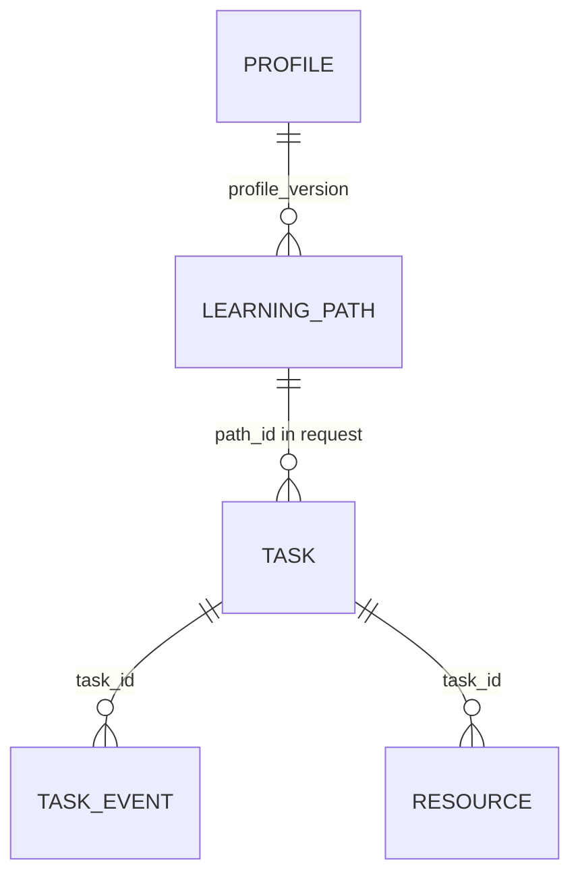

# EduAgent 数据库设计

## 1. 运行方式

EduAgent 使用 Python 标准库 SQLite，默认数据库位于 `data/eduagent.db`。相对数据库地址始终按项目根目录解析。运行数据库及 WAL 文件被 `.gitignore` 排除，不进入提交包。

连接启用：

- `foreign_keys=ON`
- `journal_mode=WAL`
- 10 秒连接超时
- 写入成功提交、异常回滚

## 2. 表结构

### profiles

| 列 | 说明 |
|---|---|
| `student_id` | 学生标识 |
| `version` | 画像版本 |
| `profile_json` | 完整 `StudentProfile` |
| `created_at` | 保存时间 |

主键为 `(student_id, version)`。更新画像时新增版本，不覆盖历史。

### learning_paths

| 列 | 说明 |
|---|---|
| `path_id` | 路径 ID，主键 |
| `student_id` | 学生标识 |
| `profile_version` | 依赖的画像版本 |
| `path_json` | 完整 `LearningPath` |
| `created_at` | 保存时间 |

按学生和创建时间建立索引，用于读取最新路径和评价后路径。

### resources

| 列 | 说明 |
|---|---|
| `resource_id` | 资源 ID，主键 |
| `task_id` | 生成任务 ID |
| `resource_type` | 五类资源之一 |
| `resource_json` | 完整 `Resource` |
| `created_at` | 保存时间 |

只有经过公共校验和 Reviewer 流程的资源写入。被拒绝或审校异常的内容不作为成功资源保存。

### tasks

| 列 | 说明 |
|---|---|
| `task_id` | 任务 ID，主键 |
| `task_json` | 完整 `TaskState` |
| `created_at` | 创建时间 |
| `updated_at` | 最后更新时间 |

任务最终收敛到 `completed`、`partial_success` 或 `failed`。

### task_events

| 列 | 说明 |
|---|---|
| `task_id` | 所属任务 |
| `sequence` | 任务内严格递增序号 |
| `event_json` | 完整 TaskEvent |
| `created_at` | 创建时间 |

主键为 `(task_id, sequence)`，并通过外键关联 `tasks`。删除任务时事件级联删除。sequence 在写事务中分配，支持 SSE 断线续传。

## 3. 数据关系

画像和路径的完整关系信息保存在 JSON 公共对象中；数据库没有引入额外公共字段。

## 4. Evaluation 数据

Evaluation 不新增公共数据库表。系统从持久化 Quiz 读取真实题目和答案，计算结果后：

1. 保存画像新版本；
2. 保存重新规划的路径；
3. 通过 Evaluation 响应返回评价摘要和更新引用。

评价证据在画像中标记为 `evaluation`。

## 5. 资源缓存

TTL/LRU 资源缓存只存在于后端进程内，不写 SQLite。它保存 Reviewer `approved` 且不是 development fallback 的资源快照。

缓存键包含画像和路径指纹、模型、知识库版本及生成器修订号。缓存命中后生成新的资源和 Quiz 题目 ID，再次审校并写入数据库。因此数据库中的每个任务仍有独立、可追踪的资源实体。

## 6. 备份与清理

演示数据可以通过复制 SQLite 数据库及同时存在的 WAL 文件进行备份，但不得提交到 Git。清空演示数据前应停止后端，避免复制或删除正在写入的数据库。
